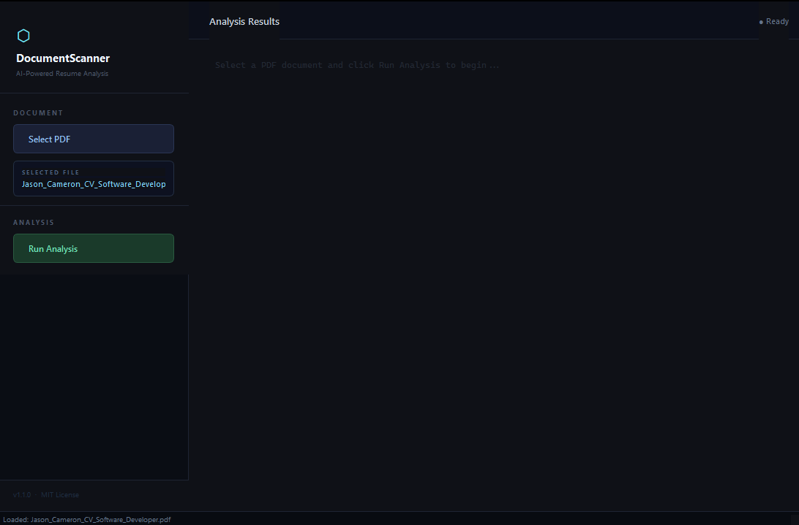
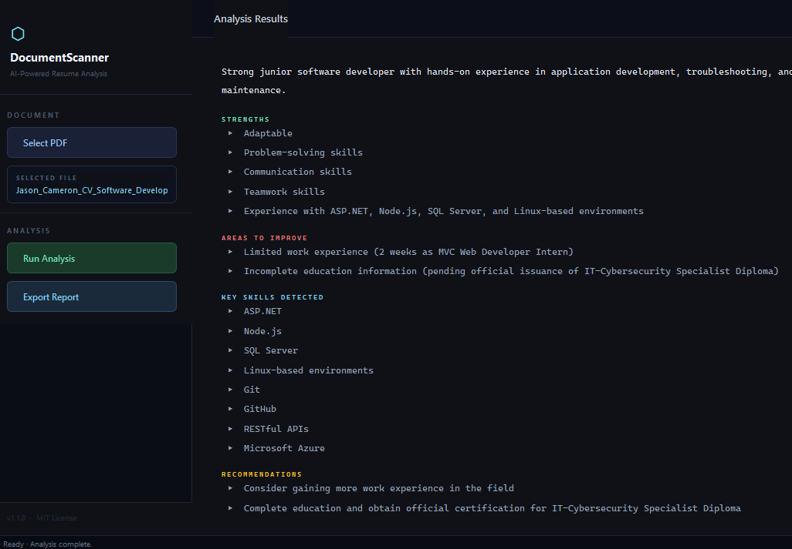

# DocumentScannerAI

[](https://www.python.org/downloads/)
[](LICENSE)
[](https://www.riverbankcomputing.com/software/pyqt/)
[](https://ollama.com)

A PDF resume analyzer with a dark-themed GUI. Uses a local **Ollama LLM** (llama3.1:8b) to analyze resumes. All processing runs on your machine — nothing is sent to external servers.

---

## Screenshots

**PDF Loaded (Ready to Analyze)**  


**Analysis Complete**  


---

## Features

- **Dark-themed GUI** — PyQt6 interface with sidebar controls, no terminal required
- **Drag-and-Drop** — Drop PDF files directly onto the window for instant loading
- **Progress Bar** — Visual indicator while analysis is running
- **PDF Validation** — Checks file extension and PDF magic number (`%PDF-`)
- **File Size Limit** — Enforces 50MB maximum to prevent memory issues
- **Security Scanning** — Scans for embedded JavaScript, auto-run actions, launch commands, and hidden files
- **Text Extraction** — Resume-specific cleanup via `pdfplumber`: detects section headers, fixes hyphenated breaks, removes junk lines, normalizes whitespace
- **Local AI Analysis** — Uses `llama3.1:8b` running locally:
  - Overall impression
  - Strengths
  - Weaknesses
  - Key skills
  - Recommendations
- **Export to PDF** — Save analysis results as a formatted PDF report
- **Privacy** — All processing stays on your machine. No API keys, no accounts, no telemetry
- **Helpful Error Messages** — Clear, actionable guidance when something goes wrong
- **Logging** — Full audit trail written to `scanner.log`

---

## Requirements

- **Windows, macOS, or Linux** — Currently tested on Windows. macOS and Linux support coming soon.
- Python 3.10 or higher
- [Ollama](https://ollama.com) — local LLM platform (system install, not pip)

---

## Setup

### 1. Clone the repo

```bash
git clone https://github.com/CloudyJayC/DocumentScannerAI.git
cd DocumentScannerAI
```

### 2. Create a virtual environment (recommended)

```bash
# Windows
python -m venv venv
venv\Scripts\activate

# macOS / Linux
python3 -m venv venv
source venv/bin/activate
```

### 3. Install dependencies

```bash
pip install -r requirements.txt
```

### 4. Install Ollama and pull the model

Download Ollama from https://ollama.com and install it like any normal program.

Then in a terminal:

```bash
ollama pull llama3.1:8b
```

This downloads ~4.7GB one time. The model stays cached on your machine.

### 5. Run the app

Open two terminals:

```bash
# Terminal 1 — keep this running
ollama serve

# Terminal 2
python gui_main.py
```

---

## Usage

1. Click **Select PDF** (or drag-and-drop a PDF onto the window)
2. The file is validated and scanned for malicious content immediately
3. If suspicious elements are found you'll be prompted to confirm before continuing
4. Click **Run Analysis** to:
   - Run the security scan
   - Extract and clean the resume text silently
   - Send it to the local AI for analysis
5. Results appear in the main panel with colour-coded sections
6. Click **Export Report** to save a formatted PDF of the analysis

Note: If you see an error, it will include helpful instructions on what to do next.

AI analysis typically takes 10-60 seconds on first run while the model loads into memory. Subsequent runs on the same session are faster.

---

## Project Structure

```
DocumentScannerAI/
├── analysis/
│   ├── __init__.py
│   └── ai_analysis.py          — Ollama LLM interface and JSON parsing
├── file_handlers/
│   ├── __init__.py
│   └── pdf_handler.py          — PDF text extraction and cleaning
├── ui/
│   ├── __init__.py
│   ├── main_window.py          — Main application window and UI logic
│   ├── workers.py              — Background worker threads
│   └── styles.py               — Application stylesheet
├── utils/
│   ├── __init__.py
│   ├── logger.py               — Centralized logging configuration
│   ├── validators.py           — PDF validation and security scanning
│   └── html_helpers.py         — HTML rendering for results display
├── tests/
│   ├── __init__.py
│   └── test_*.py               — Unit and integration tests
├── config.py                   — Centralized configuration
├── gui_main.py                 — Application entry point ← run this
├── pyproject.toml              — Package configuration and metadata
├── requirements.txt            — Python dependencies
├── LICENSE                     — MIT License
└── README.md
```

---

## Dependencies

| Package | Purpose |
|---|---|
| `PyQt6` | GUI framework |
| `pdfplumber` | PDF text extraction |
| `requests` | HTTP utilities (tests and tooling) |
| `fpdf2` | PDF report export |
| Ollama (system) | Local LLM server |

---

## Running Tests

```bash
python -m pytest tests/
```

---

## Troubleshooting

**Ollama not connecting**
Make sure `ollama serve` is running in a separate terminal before launching the app.

**AI analysis times out**
First run is slowest — the model loads from disk into memory. Wait up to 5 minutes on first run. Subsequent runs are much faster. On Windows with an AMD GPU, Ollama runs on CPU (ROCm is Linux-only for AMD), which is slower but works fine.

**No text extracted**
The PDF may be image-only or encrypted. pdfplumber cannot extract text from scanned images.

**App won't launch**
Run `pip install -r requirements.txt` to make sure all dependencies are installed.

---

## Future Ideas

- OpenCV camera scanning support
- Resume scoring with a clear rubric and breakdown
- Accessibility improvements (keyboard shortcuts, focus states)
- Additional export formats (TXT, HTML)

---

## Author

Jason Cameron — [@CloudyJayC](https://github.com/CloudyJayC)

---

## License

MIT — see [LICENSE](LICENSE) for details.

## Acknowledgements

- [Ollama](https://ollama.com) — local LLM platform
- [PyQt6](https://www.riverbankcomputing.com/software/pyqt/) — GUI framework
- [pdfplumber](https://github.com/jamesturk/pdfplumber) — PDF text extraction
- [Meta Llama 3.1](https://www.meta.com/research/llama/) — AI model
